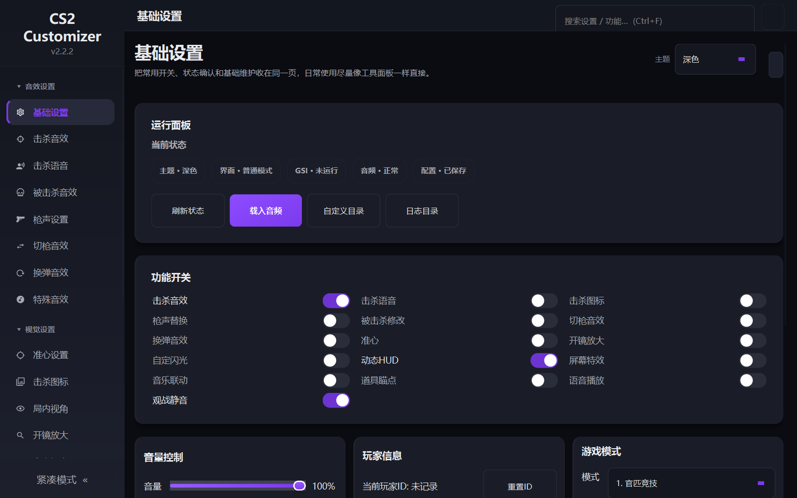
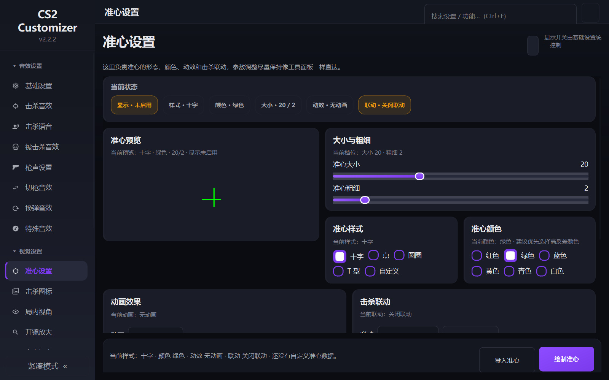
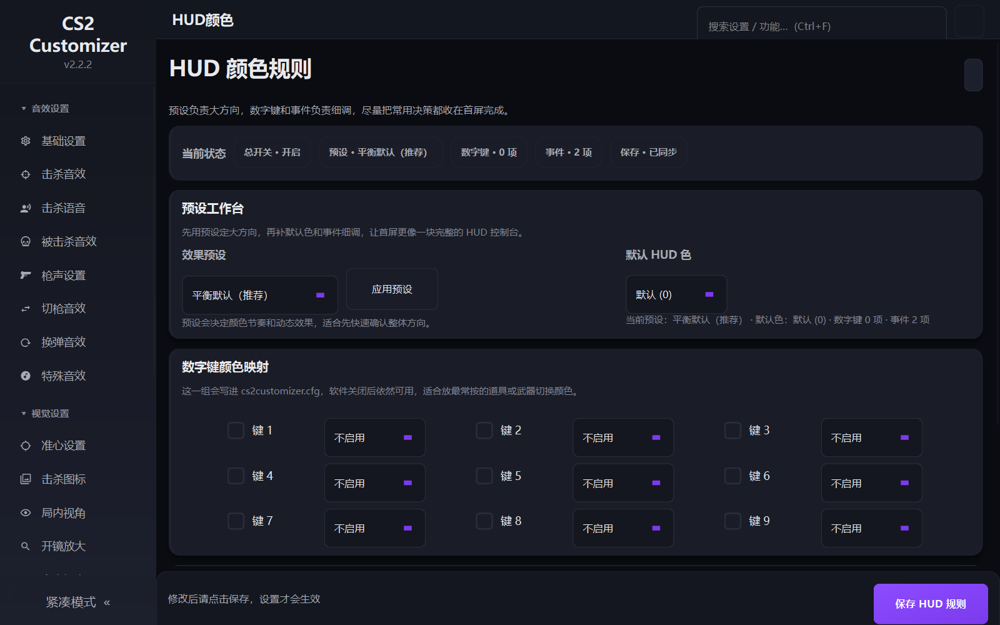
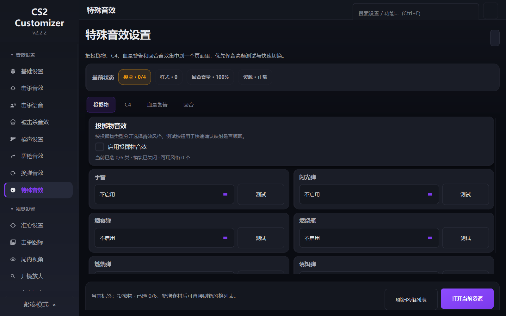
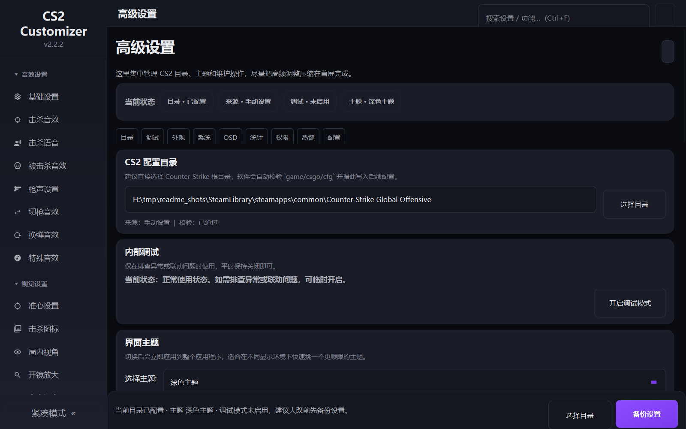
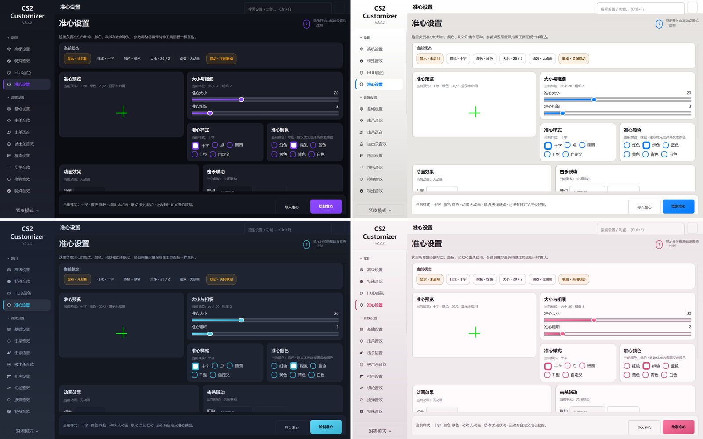

<div align="center">

# CS2 Customizer

[简体中文](README.md) · **English**

**A local personalisation tool for CS2 players**<br>
Custom crosshairs, kill sounds and icons, HUD colours, viewmodel, utility line-ups —<br>
all through Valve's official GSI endpoint for reading game state and `.cfg` files for writing settings.
It never touches the game process.

[](https://github.com/gufan0000/cs2-customizer/actions/workflows/ci.yml)
[](LICENSE)
[](https://www.python.org/)
[](#installation)
[](#development)



### 🎮 Just want to use the app → **[fantool.online](https://fantool.online)** (installer, registration required)

### 🛠️ Want to read, modify or build the code → you are in the right place

</div>

> **Those two links do not give you the same thing. To be explicit:**
>
> The website distributes the installer for the **closed-source commercial** product
> 「帆派助手 / FanTool」, and requires an account. It shares this repository's core code but is a
> **superset** — it adds accounts, cloud config sync, online update checks and online music
> platform resolving. Its interface is Simplified Chinese only.
>
> This repository is the **open-source functional subset** carved out of it, licensed under
> **GPL-3.0**, with every local feature intact. The two are independent and coexist on one
> machine (separate install directories, data directories and autostart entries).
>
> **This repository publishes no Release binaries.** For a binary, use the website; for a
> **GPL-3.0-licensed** binary, [build one yourself](#building-a-release). The download on the
> website is **not** a build of this repository's code — please do not redistribute it as
> though it were the GPL version.

> **The user interface is in Simplified Chinese only.** There is no i18n layer yet — the app
> ships Chinese strings throughout. This README is translated so you can evaluate the project,
> its licensing and its engineering practices, but be aware of the UI language before installing.
> i18n infrastructure is an explicitly welcome contribution (see [CONTRIBUTING.md](CONTRIBUTING.md)).

---

## What it is, what it is not

> This section comes first because it matters more than the feature list.

- ✅ It does exactly two things: it **reads** game state through Valve's official
  **Game State Integration (GSI)** endpoint (round phase, kill events, alive/health,
  current weapon, map, …), and it **reads and writes CS2 `.cfg` files**.
  Both are public, documented integration points that Valve provides for third-party tools.
- ❌ It does **not** read or write game memory, does **not** inject into the game process,
  does **not** hook any API, and does **not** modify any game file. It only writes the GSI
  config and its own generated cfg under `game/csgo/cfg/`, the directory Valve designates
  for exactly that.
- ❌ It grants **no competitive advantage**. Crosshairs are drawn in a separate overlay
  window, sounds play locally, HUD colours and viewmodel are set via official cfg variables.
  They change **what you see on your own screen** — nothing here reveals information you
  would not otherwise have, aims for you, or alters any in-game value. The scope zoom is
  built on Windows' own Magnification API and magnifies **the desktop image**, not the game.
- ⚠️ This project is **not affiliated with, authorized by, or endorsed by Valve Corporation**.
  Counter-Strike, CS2 and Valve are trademarks of Valve Corporation; they are used here
  descriptively (nominative fair use) only to identify the game this tool works with.

GSI works on a completely stock installation: **no game launch options are required**,
and no game file is modified. Install, then start the game as usual.

---

## Screenshots

| Crosshair | HUD colours |
| --- | --- |
| [](docs/images/crosshair.png) | [](docs/images/hud_color.png) |
| **Special sounds** | **Advanced settings** |
| [](docs/images/special_sound.png) | [](docs/images/advanced.png) |

Nine themes ship with the app; four of them (dark / light / ocean / rose):



> Screenshots are produced by `python scripts/capture_readme_shots.py`, rendered off-screen
> via `WA_DontShowOnScreen` so nothing pops up over your desktop. Re-run it after UI changes.
>
> Animated demos are not recorded yet — PRs to `docs/images/` are welcome. The three most
> worthwhile clips are crosshair-follows-settings, kill-sound triggering (you can synthesise
> GSI packets with `scripts/gsi_live_sim.py` instead of playing a real match), and the
> `Ctrl+F` search jumping straight to an individual setting row.

---

## Features

### Crosshair

- Custom style (cross / dot / circle / T-shape / your own image), colour, thickness, gap, offset
- Rendered as a **standalone Qt overlay** — toggling is instant and changes no game setting
- Optional kill-triggered animation; repaints drop to 1 FPS when idle, 24 FPS only while animating
- Can also **write the parameters into cfg** so the native in-game crosshair follows along

### Sounds and voice

- **Kill sounds / kill voice lines**, tiered by 1–5 killstreak, optionally per weapon
- **Death**, **round win/loss / MVP**, **low-health warning**, **C4** and **grenade** sounds
- **Gunshot replacement**: swap the AWP, Deagle, … report for your own audio
  (implemented via per-process volume ducking on Windows)
- **Weapon-switch / reload** sounds
- **Voice output**: a 5-slot soundboard plus sound forwarding so teammates hear it
  (requires the VB-Cable virtual audio device)
- A one-step "new style" wizard: drop in a pile of arbitrarily named audio files and it
  files them into a usable sound style

### Visuals

- **Kill icons**: separate animation sequences per killstreak tier, adjustable position
- **Custom flashbang**: replace the white-out with your own image / solid colour / gradient,
  with optional audio and fade in/out
- **HUD colours**: switch by team, health and other conditions
- **Screen effects**
- **Viewmodel**: FOV and X/Y/Z offsets, five preset hotkeys
- **Scope zoom**: Windows Magnification API, different factors for primary and secondary weapons

### Music player (local files only)

- Plays audio files from your machine — playlists, seeking, a global control bar
- GSI-linked: volume ducks automatically while you are alive in a round, restores on death
- ⚠️ **The open-source version contains no online music platform resolving or downloading.**
  Local files only.

### Utility line-ups

- Image guides for grenade line-ups, organised by map and side, summoned by hotkey
- You supply the images (see [Assets](#assets))

### Configuration management

- **Preset centre**: bundle a whole configuration into a preset, with per-map auto-switching
- **Config snapshots**: roll back a bad change; automatic snapshots never evict your manual ones
- **Resource health check**: answers "why is this sound silent?" — which file is missing,
  which config key points at a style that does not exist
- **Settings search** (`Ctrl+F`): pinyin (`zx` / `zhunxin`), typo tolerance (`dukcing`),
  colloquial queries; it does not just jump to a page, it highlights the individual row

### Interface

- 9 themes, 3 font-scale steps (1.0 / 1.1 / 1.25), full and compact window modes
- The sidebar "frequent" group reorders itself by how often you actually use each page

---

## Installation

**Requirements**

- Windows 10 / 11
- Python 3.13
- CS2 (a first-run wizard walks you through pointing at the game directory)

**Run from source**

```bash
git clone https://github.com/gufan0000/cs2-customizer.git
cd cs2-customizer
pip install -r requirements_qt.txt
python main_widget.py
```

**How GSI is wired up**

The app writes `CS2/game/csgo/cfg/gamestate_integration_cs2customizer.cfg`. The game then
POSTs state to `http://127.0.0.1:3000` (falling back to 3001–3010 if the port is taken).
Allow loopback access if the firewall asks. **No launch options are needed.**

**Privileges**

It runs unelevated by default and will not raise a UAC prompt in normal use. Only if the
scope zoom fails to initialise in some environments do you need the one-click
"restart as administrator" in *Advanced settings → Privileges*.

**Optional dependencies**

- `pycaw` / `comtypes` — runtime volume ducking for gunshot replacement and death sounds (Windows)
- `sounddevice` / `soundfile` — voice output (also needs [VB-Cable](https://vb-audio.com/Cable/))

---

## Assets

**This repository ships no audio, icons or images.** The assets bundled with the original
closed-source build came from third parties (game publishers, films, community work); the
copyright is not ours, so none of it is distributed here.

**The program starts and runs correctly with no assets at all** — every asset directory is
created on first launch, the lists are simply empty. Bring your own files and import them via
*Tools & System → Resource import wizard* (drop in a whole folder; it recognises the layout).

Assets live under `%LOCALAPPDATA%\CS2Customizer\resources\`. The wizard matches on
**directory names**, so organise your files like this and they will be filed automatically:

```
resources/
├── audio/
│   ├── kill_sounds/<style>/1.mp3 ... 5.mp3       # kill sounds, tiered by killstreak
│   ├── kill_voices/<style>/1.mp3 ... 5.mp3       # kill voice lines
│   ├── weapon_kill_sounds/<weapon>/<style>/      # per-weapon kill sounds
│   ├── weapon_kill_voices/<weapon>/<style>/
│   ├── death/<style>/                            # death sounds
│   ├── switch_weapons/<weapon>/<style>/          # weapon-switch sounds
│   ├── reload_sounds/<style>/                    # reload sounds
│   ├── grenade_sounds/<style>/                   # grenade sounds
│   ├── c4_sounds/<style>/                        # C4 sounds
│   ├── health_warning/<style>/                   # low-health warning
│   ├── round_sounds/<style>/                     # round start / win / loss / MVP
│   └── gun_sounds/<weapon>/<style>/               # gunshot replacement
├── kill_icons/<style>/                            # kill icons (may include .json animation specs)
├── flash_images/                                  # custom flashbang images
├── flash_audio/                                   # custom flashbang audio
├── utility_guides/<map>/                          # utility line-up images
└── crosshair/                                     # crosshair files
```

| Kind | Formats |
| --- | --- |
| Audio | `.mp3` `.wav` `.ogg` |
| Images (flash / line-ups) | `.png` `.jpg` `.jpeg` `.bmp` `.webp` |
| Kill icons | the image formats above, plus `.json` (animation spec) |
| Crosshair files | `.xchr` `.json` |

> **Only import assets you have the right to use.** If you redistribute a build containing
> third-party copyrighted material, that is on you as the distributor.

---

## Building a release

```bash
pip install -r requirements_qt.txt -r requirements-build.txt
python build_tools/build_release.py --mode onedir --no-obfuscate --without-bundled-assets
```

- `--without-bundled-assets` — **required for open-source builds.** The build chain asserts by
  default that assets are present in the artifact (a premise of the closed-source build);
  without this flag the artifact verification stops the build.
- `--no-obfuscate` — skip PyArmor. It needs a licence and makes no sense for an open-source build.
- `--mode onedir` — noticeably faster cold start than `onefile` (~5.9s → ~1.9s).
- `--upx` — off by default. UPX packing is a common source of AV / SmartScreen false positives.

The Windows installer is built from `build_tools/installer.iss` with
[Inno Setup](https://jrsoftware.org/isinfo.php).

Pushing a `v*` tag (or a manual dispatch) runs
[`.github/workflows/build-installer.yml`](.github/workflows/build-installer.yml), which performs
the full build plus the Inno Setup compile on a Windows runner.

It is a **gate on the packaging chain, not a distribution channel** — artifacts are retained for
90 days for debugging and **never become a Release**. It exists because the packaging chain is
itself a source of defects that `ci.yml` never touches: the onedir and onefile branches used to
behave asymmetrically (onedir failed loudly while onefile silently produced an asset-less
package), a release once carried the build machine's live config into the artifact, and a wrong
AppId in the Inno script only surfaces after installation. Only a real build reveals these.

---

## Development

**Tests must run one file per process.** pygame / Qt and friends crash natively when the whole
suite runs in a single process, so the driver isolates each file in a subprocess:

```bash
python build_tools/run_tests.py            # everything (125 files / 1393 cases, ~45s)
python build_tools/run_tests.py config hud # only files whose name contains a keyword
```

**Lint** — `ruff check .`; rules in `ruff.toml`. Every exemption carries its reason; if you add
one, write down why.

**Criteria revert-verification bench**

```bash
python scripts/revert_verify.py            # all groups
python scripts/revert_verify.py --only R10
```

It deliberately **breaks** the production code one breakpoint at a time and confirms the
corresponding test **actually turns red**, restoring everything afterwards. The reason it
exists: a test that stays green when it should not is *worse* than no test, because it makes
people believe that area is covered. Every breakpoint corresponds to a defect that really
happened — please do not invent breakpoints.

**UI audits.** After a layout change, run the overflow audit in **both** full and compact mode
(compact is a different shell, not just another window size):

```bash
python scripts/layout_overflow_audit.py --themes dark,light --scales 1.0,1.1,1.25 --require-fonts
python scripts/layout_overflow_audit.py --compact --themes dark,light --scales 1.0,1.1,1.25 --require-fonts
python scripts/ui_contrast_audit.py
python scripts/tab_order_audit.py --verbose
```

**Changed a control's label? Rebuild the search index** — `python scripts/build_search_index.py`.

**Verifying GSI changes** does not require launching the game: `scripts/gsi_live_sim.py` and
`gsi_full_sim.py` replay or synthesise GSI packets. One classic trap: **while spectating a
teammate, the `player` in the GSI payload is the person being spectated** — anything counted
as "mine" must be filtered by your own SteamID.

CI (GitHub Actions, `windows-latest` + Python 3.13) runs ruff, the full test matrix and the
four UI audits above.

Engineering documentation and internal audit records live in [`docs/`](docs/README.md) — they
are in Chinese and you almost certainly do not need to read them to contribute a fix.

---

## Contributing

Issues and PRs are welcome. Please read [CONTRIBUTING.md](CONTRIBUTING.md) first.

> ⚠️ **Opening a PR requires accepting [CLA.md](CLA.md).** You keep the copyright in your
> contribution, but you grant the maintainer the right to **sublicense it under any licence** —
> including use in the closed-source commercial version, for which you will not be paid.
> This is stated up front so you see it before writing code, not after your PR is finished.
>
> Declining is entirely reasonable: **issues, bug reports, documentation feedback and forking
> the project all require no CLA.**

The two boundaries people trip over most:

- **Never commit third-party assets** (audio, icons, game screenshots). A test guards this
  (`tests/test_no_bundled_assets.py`); committing assets turns CI red immediately.
- **Never add a capability that crosses the "read GSI + read/write cfg" line.** Memory access,
  process injection, API hooking, any form of aim assistance or information advantage —
  rejected regardless of how cleanly it is implemented.

---

## Licence

**[GNU General Public License v3.0](LICENSE).**

You may use, modify and redistribute this software freely, **including commercially**; works
derived from it must also be released under GPL-3.0 and retain the original copyright notices.

**Trademarks are reserved.** "CS2 Customizer" and the predecessor names 「帆派」「帆派助手」
"FanTool", together with the application icons, are reserved marks and are **not** covered by
the GPL-3.0 grant (the GPL licenses code, not trademarks). Fork it, sell it if you like — but
**publish under your own name and icon** so nobody mistakes your build for the original
author's or assumes an endorsement. See [NOTICE](NOTICE).

**Contributor licensing.** Merged external contributions are governed by [CLA.md](CLA.md):
contributors keep their copyright and grant the maintainer sublicensable rights, which is what
lets the same code ship both here under GPL-3.0 and in the maintainer's closed-source build.
This is the ordinary dual-licensing arrangement, and the terms are readable before you open a PR.

Counter-Strike, CS2 and Valve are trademarks of Valve Corporation. This project is not
affiliated with Valve.

---

## Acknowledgements

- [PySide6 / Qt](https://doc.qt.io/qtforpython/) — the foundation for the whole UI and the crosshair overlay
- [pygame](https://www.pygame.org/) — audio playback
- [Flask](https://flask.palletsprojects.com/) — the GSI receiver
- [qtawesome](https://github.com/spyder-ide/qtawesome) — vector icons
- [pypinyin](https://github.com/mozillazg/python-pinyin) — the pinyin layer of the settings search
- [Valve Developer Community — Counter-Strike: Global Offensive Game State Integration](https://developer.valvesoftware.com/wiki/Counter-Strike:_Global_Offensive_Game_State_Integration)
  — the official GSI documentation; every piece of game state this project uses comes from there
- [VB-Audio Virtual Cable](https://vb-audio.com/Cable/) — the virtual audio device the voice output relies on

Version history: [CHANGELOG.md](CHANGELOG.md).
